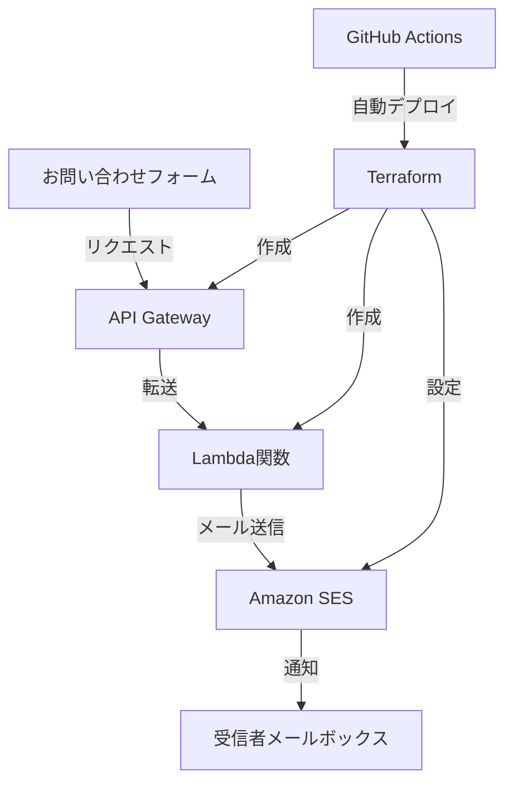
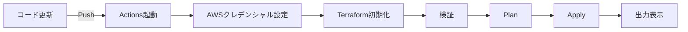
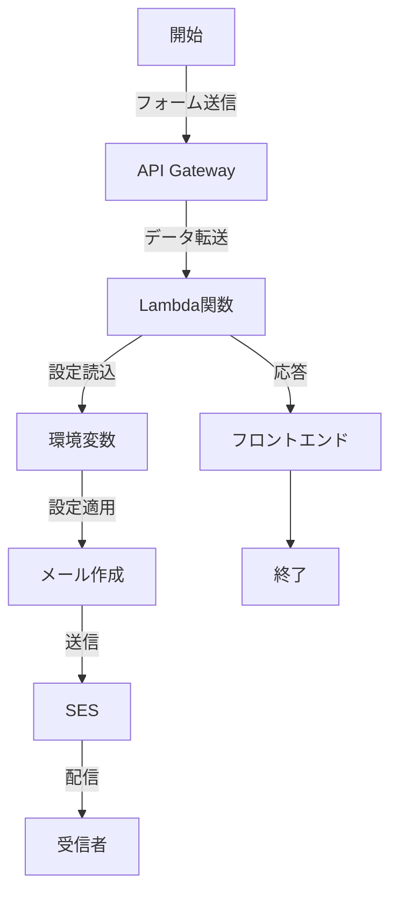

# wonder Contact Form Infrastructure

この Terraform プロジェクトは、OneWonder のお問い合わせフォームの AWS インフラストラクチャを管理するためのもので、API Gateway、Lambda を含みます。

## システム構成図



## プロジェクト構造
```
onewonder-contact-terraform/
├── .github/workflows/terraform.yml # GitHub Actions設定
├── main.tf # メインTerraform設定ファイル
├── variables.tf # 変数定義
├── outputs.tf # 出力設定
├── data.tf # データソース定義
├── backend.tf # バックエンド設定
├── email_config.json # メール設定JSONファイル
├── lambda_function.py # Lambda関数コード
├── package_lambda.sh # Lambdaパッケージングスクリプト
└── README.md # プロジェクト説明ファイル
```

## 機能特徴

- JSON ファイルによるメール設定の管理
- CORS サポートを含む完全な API Gateway 設定
- Lambda 関数が JSON 設定を環境変数に自動変換
- 完全な IAM 権限設定

## 使用方法

### 前提条件

1. Terraform のインストール (v1.6.6)
2. AWS 認証情報の設定
3. ドメイン名の DNS アクセス権限（メールセキュリティ設定用）

### デプロイ手順

1. リポジトリをクローン

   ```bash
   git clone [リポジトリURL]
   cd onewonder-contact-terraform
   ```

2. メール設定の更新

   ```bash
   # email_config.jsonファイルを編集し、正しい送信者と受信者のメールアドレスを設定
   ```

3. Lambda デプロイパッケージの作成

   ```bash
   # ワークフローでpyファイルをzipにする
   ```

4. Terraform の初期化

   ```bash
   terraform init
   ```

5. 実行計画の生成

   ```bash
   terraform plan
   ```

6. 設定の適用

   ```bash
   terraform apply
   ```

7. デプロイの確認
   ```bash
   # 出力から API Gateway URL とその他のリソース情報を確認
   terraform output
   ```

## GitHub Actions自動化フロー



## 設定項目
- リージョン: ap-northeast-1（東京）
- バックエンドS3バケット: onewonder-tfstate
- tfstateパス: wonder-contact-terraform/dev/terraform.tfstate

## セキュリティ対策
- IAMロールによる最小権限の付与
- SESメール送信の適切な権限設定
- S3バックエンドの暗号化有効化
- GitHub Secretsによる認証情報管理

## API Gateway URL

デプロイ完了後、以下のような形式の API Gateway エンドポイント URL が提供されます：
```
https://xxxxxxxxxxxx.execute-api.ap-northeast-1.amazonaws.com/prod/contact
```

この URL をフロントエンドコードの fetch リクエストに更新してください：

```javascript
const response = await fetch("YOUR_API_GATEWAY_URL", {
  method: "POST",
  headers: {
    "Content-Type": "application/json",
  },
  body: JSON.stringify(formDataObj),
});
```

## データフロー図



## トラブルシューティング

### よくある問題
1. 初期化エラー
   - S3バケットのアクセス権限を確認
   - リージョン設定を確認

2. Lambda関数のエラー
   - デプロイパッケージの作成を確認
   - IAM権限を確認

3. メール送信エラー
   - SESの検証済みメールアドレスを確認
   - SES送信クォータを確認

### 注意事項
- フロントエンドのCORS設定を確認すること
- SESはデフォルトでサンドボックス環境のため、検証済みメールアドレスのみに送信可能
- APIエンドポイントのセキュリティを確保するため、適切な認証を検討すること
